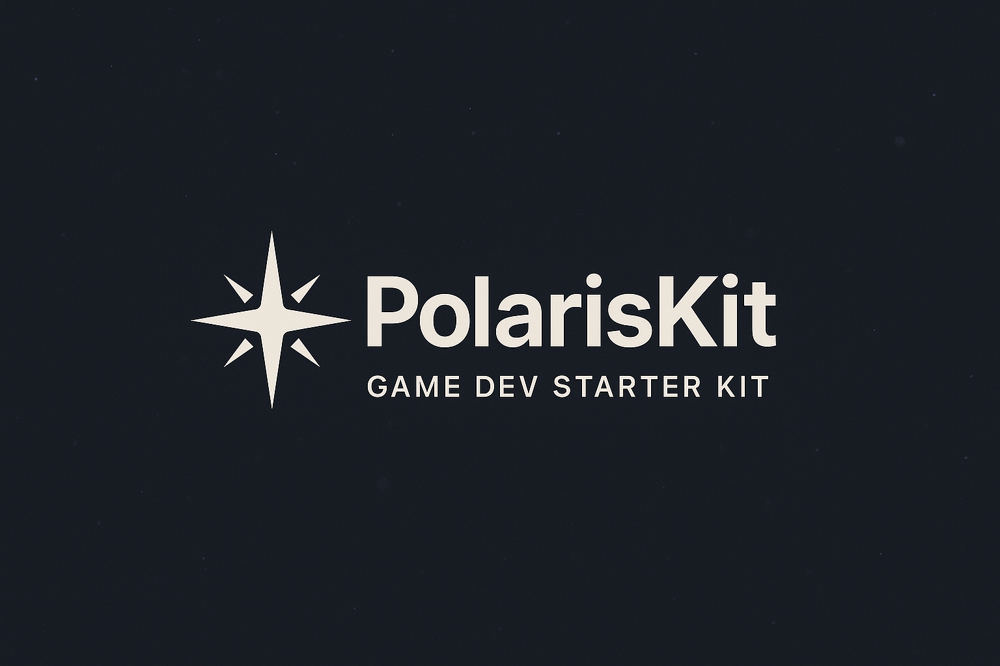

  

# ❄️ PolarisKit – A Lightweight Game Starter Kit for Pygame

**PolarisKit** is a modular, scalable, and beginner-friendly starter kit for creating 2D games in Python using Pygame.  
It includes built-in scene management, asset handling, audio control, and a global pause/debug system — all designed to help you build polished games faster.

---

## 🔍 At a Glance

- ⌨️ Python + Pygame 2.x  
- 🧱 Modular scene system  
- 🎧 Built-in audio support  
- 🧪 Debug tools for FPS + state  
- 🎬 Smooth transition system with fade support  
- 🚀 Game-ready architecture in minutes  

---

## 🚀 Features

- 🎮 **SceneManager** – Clean scene switching with stack support and built-in fade transitions  
- 🔊 **AudioManager** – Global control for music and SFX across scenes  
- ⏸️ **Pause Menu** – ESC to pause from any scene, with back-to-game or quit options  
- 🎨 **Asset Helpers** – Load images, sounds, and fonts with simple path functions  
- 🧱 **SceneBase** – Shared UI tools like centered text, score rendering, etc.  
- 🧪 **Debug Overlay** – Toggle live FPS, scene info, and more (TAB)  
- 🌄 **Built-in Fade System** – Automatic fade-in and fade-out during major scene changes  
- 💡 **Modular Folder Structure** – Easy to extend, clean to maintain  

---

## 🧪 Upcoming Features

### Core Architecture

- [x] Scene stack manager supports `push()`, `pop()`, `replace()`  
- [ ] SceneManager supports stack draw behavior (draw entire stack)  
- [x] Scene registration system (`scene_registry`) working  
- [ ] Transition system wraps scenes with a `FadeOutScene` wrapper  
- [ ] Scene args supported (SceneManager can pass args to scenes)  

### SceneBase Features

- [x] `handle_keydown(event)` pattern used consistently  
- [x] `save_manager` access and update pattern  
- [x] Debug overlay support  

### SceneManager Features

- [ ] Built-in `FadeOutScene` wrapper for `replace()` transitions  
- [ ] Fade-in behavior scaffolded (TBD: centralized vs scene-local)  
- [ ] Optional `fade=False` flag for manual transition control  

### Scene Patterns

- [x] All scenes use `handle_keydown()`  
- [x] All scenes use constants for text (e.g. `TITLE_TEXT`)  
- [x] All scenes use `helper_font` and display credits  

### Global Features

- [ ] Global config (e.g. `SHOW_FPS`, `DEBUG_MODE`) via `settings/config.py`  
- [ ] Consistent fade-out on major scene transitions (`replace()`)  

---

## 🎭 Included Standard Scenes

- [x] IntroScene – Polaris logo + fade in/out  
- [x] TitleScene – Game start menu with music  
- [ ] MainScene – Gameplay scene  
- [x] PauseScene – ESC → overlay with resume + quit  

---

## 📘 Version History

### v2.3 – Fade System Integration (Coming Soon)
- Added fade-out wrapper for scene transitions
- Automatic fading on `replace()` transitions
- IntroScene + TitleScene now support fade visuals
- SceneManager handles transition timing
- Maintains push/pop behavior as instant

### v2.2 – Event Handler Update
- Removed event handling from the `update()` function
- Added constants for text assets
- Improved Title Screen UI

### v2.1 – AudioManager Update
- Added global `AudioManager` for music and SFX
- Scenes can now control background music and sound effects
- Small bug fixes and formatting improvements

### v2.0 – Modular PolarisKit Core
- Redesigned folder structure for clarity and reusability
- Added `SceneManager`, `SceneFactory`, and `SceneRegistry`
- Introduced `PauseScene` with built-in controls
- Debug overlay toggle (TAB) with scene name, FPS, and manager state
- Centralized asset loading with `ASSET()`, `IMAGE()`, `SOUND()`, `FONT()` helpers

---

## 🕹️ Controls

- `SPACE`: Start the game  
- `ESC`: Pause the game  
- `B`: Resume from pause  
- `Q`: Quit from pause  
- `TAB`: Toggle debug overlay  

---

## 📦 Requirements

- Python 3.8 or later  
- Pygame 2.x  

---

## 💡 Why PolarisKit?

PolarisKit helps you start faster and stay organized when building 2D games with Pygame.  
It's lightweight enough for small arcade projects, but structured enough to support full-scale game systems.

---

## 🔒 Code Access

> The codebase is currently **private**.  
> This repository is a **project showcase** highlighting features, screenshots, and development direction.  
> Interested in early access or collaboration?  
> Reach out via [LinkedIn](https://www.linkedin.com/in/marco-a-gonzalez99).

---

## 👤 Built By

Marco @ **SB Studios**  
[GitHub](https://github.com/marcogonzalez99) · [LinkedIn](https://www.linkedin.com/in/marco-a-gonzalez99)

---

## 🧊 Games Built with PolarisKit

- **Galactic Tour 64** – Arcade-style racing  
- **Callisto’s Trial** – Action roguelike  
- **Solen** – Calm top-down world-building  
